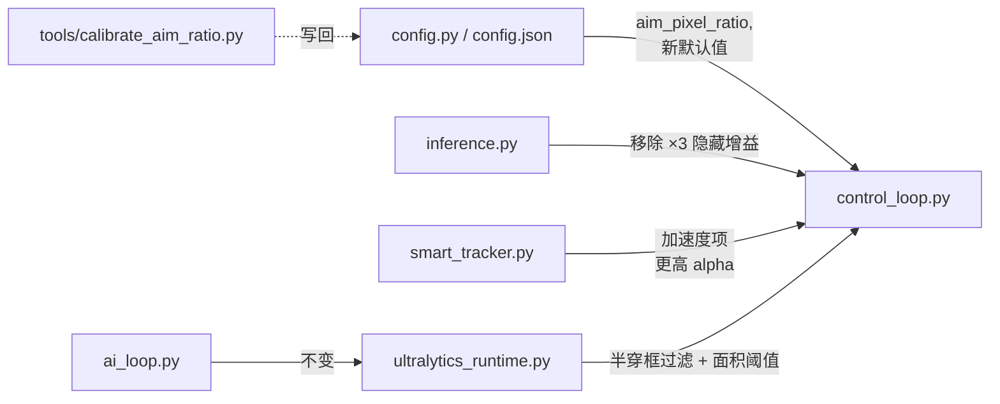

## 背景与根因诊断

| 症状 | 直接根因 | 关联文件 |
| --- | --- | --- |
| 准星扫过头然后回拉（过冲） | `aim_pixel_ratio` 缺失，`PIDController._calculate_adjusted_kp` 隐藏 ×3 增益，`_ACQUIRE_GAIN=1.75` + 18% 显式过冲 | `src/core/inference.py`, `src/core/control_loop.py` |
| 横向移动目标追不上 | `prediction_max_distance_px=20`、`_DYNAMIC_PREDICTION_MAX_DISTANCE_PX=60` 上限太死；`prediction_lead_time_s` 不随实际管线延迟自适应；`target_point_smoothing_alpha=0.35` + acquire/track 强制最小 alpha 让 EMA 滞后 | `src/core/control_loop.py`, `src/core/smart_tracker.py` |
| 检测抖 / 偶发误锁 | `min_confidence=0.11` 过低；目标选择只按 (距离/置信度)；锁定无多帧一致性；FOV 边缘半框检测会被算分 | `config.json`, `src/core/control_loop.py::_select_target`, `src/core/ultralytics_runtime.py` |

下面四个阶段可独立验证、独立上线，建议按顺序合入。

---

## 阶段一 · 控制器底盘修正（消除"隐性放大"与"不可校准"）

目标：让 PID 输出对参数线性、可预测；让"鼠标 dx → 屏幕像素"成为显式比例。

1. **去掉 PID 的隐藏 ×3 增益**
   - `src/core/inference.py::PIDController._calculate_adjusted_kp` 整体删除，`update()` 直接用 `self.Kp * error`。
   - 把当前 `pid_kp_x=0.45`（实际等效 0.45，因为 ≤0.5）保留作为默认值；同时给出"如果之前你把 kp 调到过 0.5 以上，需要把它除以 3 后重设"的迁移说明（`migrate_config_data`）。

2. **新增鼠标→屏幕像素比例（核心修复点）**
   - 在 [src/core/config.py](src/core/config.py) `Config` + `to_dict` + `_validate_stability_settings` 里加 `aim_pixel_ratio_x: float = 1.0`、`aim_pixel_ratio_y: float = 1.0`，clamp 到 `[0.1, 10.0]`。
   - 在 [src/core/control_loop.py](src/core/control_loop.py) `RuntimeControlSettings` 里加同名两个字段。
   - `_apply_control_output` 中输出阶段：
     ```python
     # final_error_* 仍是屏幕像素 → 反推鼠标 dx
     mouse_dx_raw = pid_x.update(final_error_x, tick_dt) * stale_gain * stage_gain / settings.aim_pixel_ratio_x
     mouse_dy_raw = pid_y.update(final_error_y, tick_dt) * stale_gain * stage_gain / settings.aim_pixel_ratio_y
     ```
   - 同时 `state.applied_mouse_dx/dy` 累积时反向乘回比例（保持以"屏幕像素"为单位的口径），让"剩余误差"逻辑保持一致。

3. **acquire 阶段不再允许过冲**
   - `_clamp_move_to_stage_limit` 里把 `_ACQUIRE_OVERSHOOT_RATIO`、`_ACQUIRE_MAX_OVERSHOOT_PX` 默认改 `0`，acquire 也走 `_clamp_move_to_error`。
   - `_ACQUIRE_GAIN` 由 `1.75` 降到 `1.25`，`_ACQUIRE_MIN_MOVE_PX` 从 `3` 降到 `2`。
   - 保留这些常量在文件顶部以便后续微调。

4. **让 PID 的 D 项真正起作用**
   - 默认 `pid_kd_x = pid_kd_y = 0.012`（按现 detect_interval=0.005、kp=0.45，给一个保守阻尼）。
   - 在 `_validate_stability_settings` 里给 Kd clamp `[0.0, 0.1]`。
   - 配合移除 ×3 增益，避免新 D 项被无意放大。

**验证标准**：在静态目标 ±100px 偏差下，准星应单调收敛、无回弹；从静止开始锁定头部后停留误差 ≤ `aim_position_deadzone_px`（默认 1px）。

---

## 阶段二 · 预测与平滑修正（追上移动目标）

目标：让"目标在动 + 准星在转 + 端到端延迟"三者都被预测器吸收。

1. **测量真实端到端延迟并反馈给预测**
   - [src/core/control_loop.py](src/core/control_loop.py) 已经有 `frame.captured_perf` 与 `current_perf`。在 `_apply_control_output` 里计算的 `target_age_ms` 当前只用于 stale 判断，把它累加到 `prediction_lead_time_s` 用于 `_refresh_dynamic_control_target`：
     ```python
     effective_lead_s = settings.prediction_lead_time_s + max(target_age_ms, 0.0) / 1000.0
     ```
     （现在 `_refresh_dynamic_control_target` 已经这么做了，但 `_update_tracker_targets` 里第一次预测没做。把 `_update_tracker_targets` 也改成接收 `target_age_ms` 并使用 `effective_lead_s`。）

2. **解放预测距离上限**
   - 把 `_DYNAMIC_PREDICTION_MAX_DISTANCE_PX` 由 `60.0` 提升到 `200.0`。
   - 把 [config.json](config.json) `prediction_max_distance_px` 默认 `20.0 → 80.0`，clamp 上限也从 `200` 提升到 `400`（`_validate_stability_settings`）。
   - 仍保留"按速度 × lead_time 动态算"的逻辑，避免静态目标被错误拉远。

3. **加速度（二阶）预测可选项**
   - [src/core/smart_tracker.py](src/core/smart_tracker.py) `SmartTracker` 增加 `ax`/`ay`（速度的 EMA 差分）。
   - `get_predicted_position` 增加二阶项 `0.5 * a * t^2`，但仅当 `lock_match_frames >= 3 且 |a| 在合理范围` 时启用，避免噪声放大。
   - 配置项 `tracker_use_acceleration: bool = False`（默认关闭，验证后再默认开）。

4. **降低横向 EMA 滞后**
   - `target_point_smoothing_alpha` 默认 `0.35 → 0.55`。
   - `_TRACK_MIN_ALPHA` 由 `0.45 → 0.65`，`_ACQUIRE_MIN_ALPHA` 由 `0.82 → 0.9`。
   - `velocity_ema_alpha` 默认 `0.45 → 0.6`。
   - `prediction_lead_time_s` 默认 `0.018 → 0.024`（弥补常态约 6ms 的额外管线延迟）。

**验证标准**：开启 `enable_latency_stats` 后日志里 `target_age` 稳定 < 25ms；目标横移 ~600px/s 时准星偏差 < 头部框宽的 50%（不再"打到肩膀外"）。

---

## 阶段三 · 检测可靠度（减少抖动 / 误锁）

1. **收紧默认置信度**
   - [config.json](config.json) `min_confidence: 0.11 → 0.30`。
   - 在 `_validate_stability_settings` 里 clamp `[0.05, 0.9]`。

2. **目标选择加入"多帧一致性"门槛**
   - [src/core/control_loop.py](src/core/control_loop.py) `_select_target`：当 `previous_box is None`（首次锁定）时，把"score 最低的候选"再做一道一致性检查——比较与上一帧 `nearest_candidate` 的中心位移；位移 > `lock_retain_radius_px * 2` 视为不稳定，本帧不锁，等下一帧。
   - 把当前 `_ACQUIRE_MATCH_FRAMES = 3` 提到 `4`，避免噪声触发 acquire 高增益阶段。

3. **过滤"半穿框"**
   - [src/core/ultralytics_runtime.py](src/core/ultralytics_runtime.py) `detect()` 里 `fov_bounds` 过滤目前只看"是否相交"。改为：要求"框中心"或"≥50% 面积"在 fov_bounds 内才保留；这能显著减少 FOV 边缘半个身体被锁定的情况。

4. **目标选择 score 加入"框面积合理性"**
   - 在 `_candidate_for_box` 里把 `weighted_distance_sq` 改为 `weighted_distance_sq / sqrt(area)`，让小到不合理的伪检测被弱化。
   - 加常量 `_MIN_BOX_AREA_PX2 = 64` 直接丢弃过小框（现实中头/身体框 < 8×8 几乎都是噪声）。

5. **可选：升级到 YOLO12M**
   - 你磁盘上只有 `yolo12n_cs2.engine`。如果想走更高准确度路线，提供一个一行命令的转换说明（用 ultralytics CLI 把 `Model/yolo12m_cs2.pt` 或 `.onnx` 导出为 `.engine`），并在 GUI 模型选择里允许切换。本阶段不强制，作为附录。

**验证标准**：原地不动 / 看墙时不应该出现框；目标半边出 FOV 时不再被锁定；常见误检率 ≥ 50% 下降（凭日志统计 `boxes` 数量）。

---

## 阶段四 · 一次性灵敏度校准工具（可选但强烈建议）

为阶段一的 `aim_pixel_ratio_*` 给出一个无侵入的标定方法，避免你手工试错。

1. **新增脚本 `tools/calibrate_aim_ratio.py`**
   - 流程：进入 CS2 训练靶场 → 运行脚本 → 脚本调用 `send_mouse_move(N, 0)` 一次大幅水平位移；同时通过 `dxcam` 在位移前后各抓一帧；用相位相关（`cv2.phaseCorrelate` 或简单的中心 ROI cross-correlation）算出屏幕像素位移 `Δscreen_x`；`aim_pixel_ratio_x = Δscreen_x / N`。
   - 重复 5 次平均；y 轴同理。
   - 把结果直接写入 `config.json`。
   - 目录下已有 `dxcam`、`win_utils.send_mouse_move`，无需新依赖。

2. **可选：状态面板按钮**
   - [src/gui/status_panel.py](src/gui/status_panel.py) 加一个"灵敏度校准"按钮，触发上述流程并显示结果（这一步可单独再开 PR）。

---

## 修改一览（关键文件）



主要新增/修改：
- 修改：[src/core/inference.py](src/core/inference.py)、[src/core/control_loop.py](src/core/control_loop.py)、[src/core/smart_tracker.py](src/core/smart_tracker.py)、[src/core/config.py](src/core/config.py)、[src/core/ultralytics_runtime.py](src/core/ultralytics_runtime.py)、[config.json](config.json)
- 新增：`tools/calibrate_aim_ratio.py`
- 测试：在 [tests/](tests/) 下补 `test_pid_no_hidden_gain.py`、`test_smart_tracker_acceleration.py`、`test_control_pixel_ratio.py`

---

## 风险与回滚

- 所有新配置项都给安全默认值（`aim_pixel_ratio=1.0`、`tracker_use_acceleration=False`），不会改变未升级用户的可观测行为。
- 阶段一改完会让"过冲"立即缓解但绝对收敛速度可能变慢；如果反馈"反应钝"，回到阶段二把 `prediction_lead_time_s` 与 `target_point_smoothing_alpha` 调高。
- 删除 `_calculate_adjusted_kp` 是破坏性变更；用 `migrate_config_data` 在 controller_version 升到 3 时把存量 `kp > 0.5` 的值乘 3，保持等效手感。

---

## 建议的提交切分

- PR1：阶段一（PID + ratio + acquire 限幅）+ 迁移 + 单测
- PR2：阶段二（预测/平滑参数 + 二阶预测开关）
- PR3：阶段三（检测可靠度三连）
- PR4：阶段四（校准工具，独立可选）
