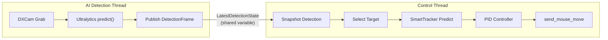

# Aimbot Pipeline Bottleneck Analysis

## Architecture Overview

The system runs two independent threads communicating via a shared `LatestDetectionState`:




---

## Category A: End-to-End Latency (the biggest problem)

### A1. Serial Pipeline - No Parallelism

In `[ai_loop.py](src/core/ai_loop.py)` line 389-410, capture and inference are completely serial:

```
Capture frame (2-5ms) → Ultralytics predict() (8-25ms) → Publish → Sleep
```

There is no overlap between capture and inference. A pipelined approach (capture frame N+1 while inferring on frame N) could cut perceived latency by the capture time.

### A2. Ultralytics predict() High-Level API Overhead

In `[ultralytics_runtime.py](src/core/ultralytics_runtime.py)` line 41-46, the code calls `self._model.predict(source=frame, imgsz=..., verbose=False)`. This is Ultralytics' full pipeline: image preprocessing (resize/letterbox/normalize/HWC-to-CHW/CPU-to-GPU copy), TensorRT inference, NMS, and Result object construction. Each of those sub-steps has Python overhead that a raw TensorRT session would avoid. The `preprocess_image()` function in `[inference.py](src/core/inference.py)` exists but is **not wired into the live path**.

### A3. DXCam Snapshot Mode (Not Continuous)

In `[capture.py](src/core/capture.py)` line 52, `self._camera.grab(region=...)` is called in snapshot mode. Each call requests a fresh frame from the Desktop Duplication API. Using `dxcam.start(target_fps=...)` with a ring buffer would allow the AI loop to always grab the **latest available frame** without waiting for capture, significantly reducing capture latency.

### A4. Artificial Detection Rate Throttle

In `[ai_loop.py](src/core/ai_loop.py)` line 432-434:

```python
desired_interval = settings.detect_interval if is_aiming else settings.idle_detect_interval
remaining = desired_interval - (time.perf_counter() - loop_start_perf)
_wait_precisely(remaining)
```

Default `detect_interval=0.02s` (50 FPS). If inference is fast enough (e.g. TensorRT on a good GPU can do ~3ms), the loop **sleeps away** most of its budget. Reducing this or removing the sleep entirely would increase detection rate.

---

## Category B: Stale Data Problem (causes lag when moving)

### B1. Crosshair Position Sampled Once Per Detection

In `[ai_loop.py](src/core/ai_loop.py)` line 360 and 378:

```python
_update_crosshair_position(config, settings, half_width, half_height)  # line 360
# ... several ms later ...
crosshair_x, crosshair_y = config.crosshairX, config.crosshairY  # line 378
```

The crosshair position is captured **once** at the start of the detection loop iteration. By the time the inference finishes (~10-25ms later), the user may have moved the mouse significantly. The published `DetectionFrame.crosshair_x/y` is already stale.

### B2. Control Loop Uses Stale Crosshair from Detection Frame

In `[control_loop.py](src/core/control_loop.py)` line 738-751, `_apply_control_output` uses `frame.crosshair_x, frame.crosshair_y` from the detection frame rather than querying the **current** cursor position. This means the error calculation is based on where the crosshair **was**, not where it **is now**.

### B3. Very Short Stale Tolerance Window

In `[control_loop.py](src/core/control_loop.py)` line 649-653:

```python
stale_limit_ms = settings.control_stale_hold_ms + settings.control_stale_decay_ms  # 12 + 24 = 36ms
if target_age_ms > stale_limit_ms:
    _reset_control_state(...)  # gives up entirely!
```

If detection takes >36ms, the control loop **drops the target entirely** and resets. This creates visible "jumps" when detection is slow.

---

## Category C: Tracking & Prediction Limitations

### C1. SmartTracker Linear Prediction Only

In `[smart_tracker.py](src/core/smart_tracker.py)` line 82-83:

```python
pred_dx = self.vx * prediction_time_s
pred_dy = self.vy * prediction_time_s
```

Pure linear extrapolation with no acceleration modeling. Targets that curve, strafe, or change speed will always be predicted incorrectly. A Kalman filter or at minimum a constant-acceleration model would significantly improve tracking of non-linear motion.

### C2. Prediction Parameters Too Conservative

Default values from `[control_loop.py](src/core/control_loop.py)` line 134, 142:

- `prediction_lead_time_s=0.018` (18ms) -- barely compensates for 1 detection frame
- `prediction_max_distance_px=20.0` -- hard cap on prediction distance

The lead time should be closer to the **full pipeline latency** (capture + inference + control = 15-30ms+), and the max distance cap prevents proper prediction for fast strafing targets.

### C3. Velocity Deadzone Kills Low-Speed Tracking

In `[smart_tracker.py](src/core/smart_tracker.py)` line 65-68:

```python
if abs(self.vx) < self.velocity_deadzone_px_per_s:
    self.vx = 0.0
```

Default `velocity_deadzone_px_per_s=10.0`. Slow-moving targets or targets moving slowly in one axis have their velocity zeroed out, meaning no prediction at all for slow movements.

### C4. Direction Reversal Resets Velocity

In `[smart_tracker.py](src/core/smart_tracker.py)` line 57-59:

```python
if jump_distance >= jump_limit or dot_product < 0.0:
    self.vx = raw_vx
    self.vy = raw_vy
```

When a target reverses direction, the EMA history is discarded and raw velocity is used. This causes a prediction discontinuity (sudden jump) on every direction change.

---

## Category D: Control Loop Issues

### D1. Target Point Smoothing Adds Lag

In `[control_loop.py](src/core/control_loop.py)` line 454-455:

```python
state.smoothed_target_x = ((1.0 - smoothing_alpha) * projected_smoothed_x) + (smoothing_alpha * target_x)
```

With minimum `_TRACK_MIN_ALPHA=0.45`, only 45% of each new measurement is incorporated. For a target moving at constant speed, this means the smoothed position always lags behind by roughly `(1 - alpha) / alpha * detection_interval` time.

### D2. PID Kp Nonlinear Scaling

In `[inference.py](src/core/inference.py)` line 63-66:

```python
def _calculate_adjusted_kp(self, kp: float) -> float:
    if kp <= 0.5:
        return kp
    return 0.5 + (kp - 0.5) * 3.0
```

For Kp > 0.5, the gain ramps up at 3x rate. This can cause oscillation when the error is large (acquire phase), then undershoot when error is small, making the aim "wobble" around the target.

### D3. No Integral Term (Steady-State Error)

Default `pid_ki_x=0.0, pid_ki_y=0.0`. Without an integral term, there's no correction for consistent small errors. If the target moves at constant velocity, the PID will always lag behind by a fixed offset proportional to velocity.

### D4. Applied Mouse Delta Accuracy

In `[control_loop.py](src/core/control_loop.py)` line 662-663:

```python
measured_error_x = _remaining_error_after_applied_move(state.measured_target_x - crosshair_x, state.applied_mouse_dx)
```

Between detection frames, the control loop estimates remaining error by subtracting accumulated mouse deltas. But there is no guarantee that `send_mouse_move(dx, dy)` actually moved the cursor by exactly `(dx, dy)` pixels -- in-game sensitivity, acceleration, aim punch, and game smoothing all affect the actual result.

---

## Category E: Self-Movement Specific Issues

### E1. Screen Motion Compensation is Approximate

In `[control_loop.py](src/core/control_loop.py)` line 506-510:

```python
self_motion_dx = crosshair_x - state.last_crosshair_x
self_motion_dy = crosshair_y - state.last_crosshair_y
compensation_ratio = settings.screen_motion_compensation_ratio if settings.screen_motion_compensation_enabled else 0.0
motion_dx = measured_screen_dx + (self_motion_dx * compensation_ratio)
```

This assumes a 1:1 mapping between crosshair movement and screen-space shift. In reality, the relationship depends on in-game FOV, sensitivity, and whether the game has any smoothing. The fixed `compensation_ratio=1.0` is an approximation.

### E2. Detection Region Shifts With Crosshair

When `fov_follow_mouse=True`, the capture region follows the crosshair. When the player moves the mouse quickly, the detection region shifts between frames. This means:

- The same target may appear at different positions in consecutive captures just from camera movement
- If the target exits the detection region during fast turning, it's lost entirely
- The region calculation uses the crosshair from the **start** of the loop (already stale by the end)

---

## Recommended Fixes (Priority Order)

### P0 - High Impact, Moderate Effort

1. **Reduce Ultralytics overhead**: Bypass `predict()` and call the TensorRT engine directly with pre-allocated GPU buffers. Use the existing `preprocess_image()` in `[inference.py](src/core/inference.py)` or write a CUDA-accelerated preprocess. This alone can cut inference latency by 30-50%.
2. **Use DXCam continuous mode**: Switch from `grab()` to `start(target_fps=120)` + `get_latest_frame()` so the capture backend always has a fresh frame without blocking.
3. **Re-query crosshair at control time**: In `_apply_control_output`, use the **current** `win32api.GetCursorPos()` instead of the stale `frame.crosshair_x/y`.

### P1 - High Impact, More Effort

1. **Pipeline capture and inference**: Run capture in a separate thread, double-buffer frames so inference never waits for capture.
2. **Increase prediction lead time**: Set `prediction_lead_time_s` to match actual measured pipeline latency (enable `enable_latency_stats=True` to measure).
3. **Increase stale tolerance**: Raise `control_stale_hold_ms + control_stale_decay_ms` to at least 2x the expected detection interval.

### P2 - Medium Impact

1. **Upgrade to Kalman filter**: Replace `SmartTracker`'s EMA velocity with a proper Kalman filter (constant-velocity or constant-acceleration model) for better prediction under noise and direction changes.
2. **Reduce target smoothing lag**: Increase `target_point_smoothing_alpha` or make it adaptive based on target speed.
3. **Remove detect_interval sleep** when inference is already slower than the interval.
4. **Add a small Ki term** to PID to eliminate steady-state tracking error.

