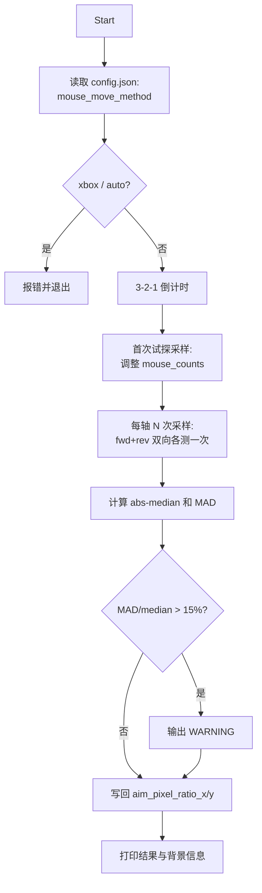

## 评估结论
脚本已满足阶段四的硬性要求（dxcam + send_mouse_move + phaseCorrelate + 写回 config.json），但有 5 个会**让校准结果在真实工况下不准**的隐患，以及若干鲁棒性/UX 不足。下面按优先级列出修改点。

## 改动文件
- [tools/calibrate_aim_ratio.py](tools/calibrate_aim_ratio.py:1)
- [tests/test_calibrate_aim_ratio.py](tests/test_calibrate_aim_ratio.py:1)（新增/扩展用例）

不会动 `src/win_utils/`、`src/core/`、`config.json` 的结构。GUI 按钮按计划单独 PR，不在本次范围。

---

## 高优：正确性修复

### 1. 默认从 `config.json` 读取 mouse_method
- 现状：默认 `--mouse-method=mouse_event` 与运行时实际后端可能不同，校准比例直接作废。
- 改法：在 [tools/calibrate_aim_ratio.py](tools/calibrate_aim_ratio.py:230) `build_parser()` 把 `--mouse-method` 默认改为 `None`；在 `run_calibration` 里若为 `None` 则读取 `--config` 里的 `mouse_move_method`，并把 `auto`/`xbox` 等不可校准后端**显式拒绝**（`xbox` 摇杆量纲不同；`auto` 让用户显式指定）。
- 输出加一行：`Calibrating with backend=<method>`。

### 2. 反向移动同样测量，单次采样产出 2 个数据点
- 现状：[tools/calibrate_aim_ratio.py](tools/calibrate_aim_ratio.py:148) 只采集前进位移，反向只用于复位。
- 改法：把"前进 N→抓帧 A→移动→抓帧 B→反向 -N→抓帧 C"改为"前进 N→A→B；反向 -N→B→C"，对 (A,B) 和 (B,C) 各做一次 `estimate_shift_px`，得到 `[shift_fwd, shift_rev]`。`shifts.append` 改为 `extend` 两个绝对值。`samples=5` 时实际拿到 10 个样本，方差更小。

### 3. 抓帧前轮询，避免拿到旧帧
- 现状：[tools/calibrate_aim_ratio.py](tools/calibrate_aim_ratio.py:125) `_capture_frame` 拿不到新帧时退回 `get_latest_frame`，可能返回位移前的缓存帧。
- 改法：新增 `_grab_fresh_frame(camera, timeout_s=0.25)`，循环 `camera.grab()` 直到返回非 `None`，超时抛 `RuntimeError("dxcam timed out waiting for fresh frame")`。或在 `create_dxcam_camera` 里直接 `camera.start(target_fps=60)`，让 `grab()` 阻塞到下一帧。

### 4. Y 轴 ROI 排除武器视模型 / 准星
- 现状：[tools/calibrate_aim_ratio.py](tools/calibrate_aim_ratio.py:71) `estimate_shift_px` 用居中 65% 裁剪，y 轴时下 1/3 的静态视模型会把相位相关锚到 0，y 比例被低估。
- 改法：把裁剪做成轴感知 —— 增加 `axis: str` 参数，y 轴时**额外把裁剪上移**（例如目标矩形中心从图像中心 y=0.5 改为 y=0.4，避开视模型；同时上下各保留至少 8% 边距避免准星）。`calibrate_axis` 里把 `axis_name` 透传进去。

### 5. 混叠 / 欠激励保护（自动调节 mouse_counts）
- 现状：高灵敏度玩家 `120 counts` 可能产生 > W/2 像素位移被相位卷绕；低灵敏度玩家 < 5px 被噪声淹没。脚本会"安静地"输出错值。
- 改法：在 `calibrate_axis` 第一次采样后做一次自检：
  - 若 `|shift| < max(5px, 0.5% × ROI_dim)` → 报警并把 `mouse_counts *= 2` 重试（最多 3 次，封顶 4× 初始值）。
  - 若 `|shift| > 0.4 × ROI_dim` → 报警并 `mouse_counts //= 2` 重试（最多 3 次，下限 8）。
  - 自检阶段的样本不计入最终结果。最终输出里打印实际使用的 `mouse_counts`（每轴）。

---

## 中优：鲁棒性与 UX

### 6. dxcam 句柄正确释放
- `run_calibration` 用 `try/finally` 包裹，结束时 `camera.stop()` + `del camera`。

### 7. 启动前的安全保护
- 加 `--countdown` 默认 3，启动后倒数 `3,2,1` 再开始抽鼠标。
- 可选：用 `ctypes.windll.user32.GetForegroundWindow` + `GetWindowTextW` 在第一次移动前检查前景窗口，标题不是 CS2 时仅打印警告（不强制退出）。

### 8. 报告方差 / MAD
- `AxisCalibration` 加 `mad_px: float` 字段；`ratio_from_shifts` 同时返回 MAD（`median(|x - median|)`）。
- 终端输出形如：`aim_pixel_ratio_x=0.85 (median 102.0px ± MAD 3.1px, samples=10, counts=120)`；当 `MAD / median > 0.15` 时打印 `WARNING: high variance, consider re-running on a more textured scene`。

### 9. 调试落盘
- 新增 `--debug-save DIR`：每一次 `estimate_shift_px` 把 (before, after, ROI) 三张图写到 `DIR/<axis>_<idx>.png`，方便排查为什么 y 轴拿不到合理位移。

### 10. CLI 文案与日志一致性
- 默认 `--mouse-method` 改为 `None` 后，help 文案改成 "Mouse backend (default: read from config.json)"；choices 增加 `auto` 但在校准时拒绝。
- 把"Updated <path>"放在 ratios 之后保留；把 `mouse_method` / `mouse_counts_x` / `mouse_counts_y` 也写一行打印。

---

## 测试调整（[tests/test_calibrate_aim_ratio.py](tests/test_calibrate_aim_ratio.py:1)）

- 现有 `test_calibrate_axis_sends_forward_and_reverse_moves_for_x`：因为反向也会被测量，断言要从"side_effect=2 个返回"改为"4 个返回 + extend"，并验证 `result.samples` 是 4 元组。
- 新增 `test_estimate_shift_px_excludes_lower_band_for_y_axis`：构造一张上半静止 + 下半模拟视模型的合成帧，断言 y 轴裁剪不会被下半段污染（例如 ROI 边界检查）。
- 新增 `test_calibrate_axis_auto_increases_counts_when_shift_too_small`：mock `estimate_shift_px` 第一次返回 `(2.0, 0.0)`，断言 `send_move` 被以 2× counts 再次调用。
- 新增 `test_calibrate_axis_auto_decreases_counts_when_shift_too_large`：mock 第一次返回 `(900.0, 0.0)`、ROI=1000，断言 counts 减半。
- 新增 `test_run_calibration_defaults_method_from_config`：写一个临时 config 含 `"mouse_move_method": "ddxoft"`，mock `send_mouse_move` 验证它被以 `ddxoft` 调用。
- 新增 `test_run_calibration_rejects_xbox_backend`：验证 `xbox`/`auto` 时抛 `SystemExit`/`RuntimeError`。
- 新增 `test_capture_frame_polls_until_fresh`：`grab()` 前两次返回 `None`、第三次返回数组，断言被消费的是第三次。
- 现有 `test_ratio_from_shifts_*` 保留；扩展返回值结构（如果加了 MAD）相应同步。

---

## 执行流程图

---

## 风险与回滚
- 改动全部局限在 `tools/` 与 `tests/`，不动运行时控制路径，不会影响阶段一/二/三的成果。
- 默认值与 CLI 参数保持向后兼容（`--mouse-method` 显式指定时行为不变）。
- 所有新逻辑（自动调节 counts、双向采样、轴感知 ROI）都可被显式开关关闭：增加 `--no-auto-tune`、`--no-bidir`、`--legacy-roi` 三个开关用于回退。
